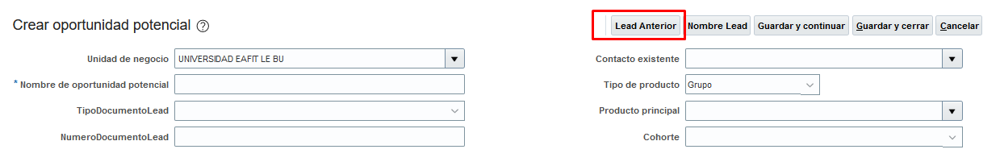
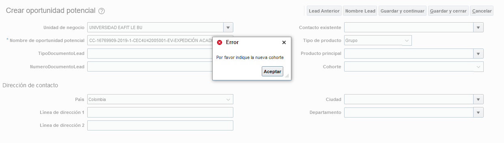

#   <Til>Dajr, 69414 sales optimizar el traspaso de una cohorte a otra de OP vigencia anterior IN00025769</Til>  

Para esta solucion, el usuario podra encontrar en la vista de creacion de lead un nuevo boton llamado <rule>**Lead Anterior**</rule>.

Para su ejecucion se debe tener en cuenta el llenado de los siguientes campos: 
-   <Variable>**Nombre de oportunidad potencial**</Variable>: corresponde a la oportunidad potencial que se le realizara el traspaso de <Variable>**Cohorte**</Variable> 
-   <Variable>**Cohorte**</Variable>: corresponde a la nueva cohorte y se utilizara para generar el nuevo nombre de oportunidad potencial, esto teniendo en cuenta que este nombre actualmente es un concatenado de los siguientes valores
    
        TipoDocumentoLead + NumeroDocumentoLead + Cohorte + Producto;

## Ejecucion

El boton <rule>**Lead Anterior**</rule> le permitira lanzar una consultar a la oportunidad potencial indicada en el campo
<Variable>**Nombre de oportunidad potencial**</Variable>, ejecutada la consulta se genera el auto llenado de los campos indicados en la siguiente tabla:

|               <Til>ATRIBUTOS               |           <Til>API NAME            |  <Til>AUTOLLENAR   |
|---------------------------------------|-------------------------------|-------|
|   Unidad de Negocio                   |   BusinessUnitId              |   X   |
|   Nombre de oportunidad potencial     |   Name                        |   X   |
|   TipoDocumentoLead                   |   EAFIT_TipoDocumentoLead_c   |   X   |
|   NumeroDocumentoLead                 |   EAFIT_NumeroDocumentoLead_c |   X   |
|   Contacto Existente                  |   PrimaryContactId            |   X   |
|   tipo de producto                    |   ProductType                 |   X   |
|   producto principal                  |   PrimaryInventoryItemId      |   X   |
|   cohorte                             |   EAFIT_Cohorte_c             |   -   |

>_Campos obtenidos del objeto [<obj>**LEAD**</obj>] en vista de creacion de lead_

Como se menciono el campo <Variable>**Nombre de oportunidad potencial**</Variable> se modificara de forma automatica mostrando la nueva <Variable>**Cohorte**</Variable> a usar

## Resumen de pasos para pruebas
1. Seleccionar Lead para traspaso de <Variable>**Cohorte**</Variable>
2. Crear Oportunidad Potencial
3. Poblar el campo <Variable>**Nombre de oportunidad potencial**</Variable> con el Lead seleccionado
4. Poblar el campo <Variable>**Cohorte**</Variable> con la nueva cohorte a usar
5. Dar Click en Boton <rule>**Lead Anterior**</rule>
6. Verificar el auto llenado de datos
6. Guardar

## Resultados
Como resultado el usuario obtendra la creacion de una oportunidad potencial con una nueva cohorte reutilizando los campos de la oportunidad potencial anterior.

## Restricciones

Como restriccion se establecio un mensaje de error si el usuario no indica una cohorte y la accion ejecutada es <rule>**Lead Anterior**</rule>

>_**NOTA**: Esta solucion fue publicada en el ambiente: test_

