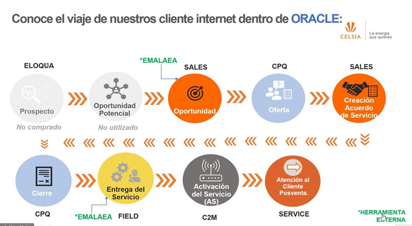

#   ESC Partner

Aplicacion en empresas de energia, hace aprox 2 años llegaron a latam,trabajan con CELSIA actualmente.
___

## Herramientas
-   CX
-   OIC
-   CPQ
___
##  Objetivo
-   Buscan un aliado en Sales y CPQ, estan abiertos

-   Oportunidad de usar aplicaciones mobile para optimizar flujos

-   mejoras con CPQ
___
## Flujo general

Inicia en Sales
-   Creacion de oportunidades
-   Crean cotizacion en CPQ
-   Creacion de acuerdos contractuales [SALES]
-   Entregan el servicio mediante field service
-   Activacion de servicios por [C2M] 
-   PQR service cloud

____

## Software adicional que interviene en el proceso
-   EMALAEA

desarrollo de diligencia

SALES -> CPQ
Clausulas Contractuales

____
condiciones de trabajo

