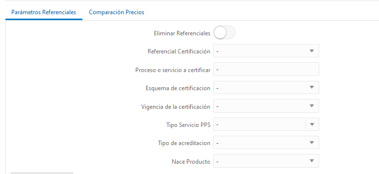
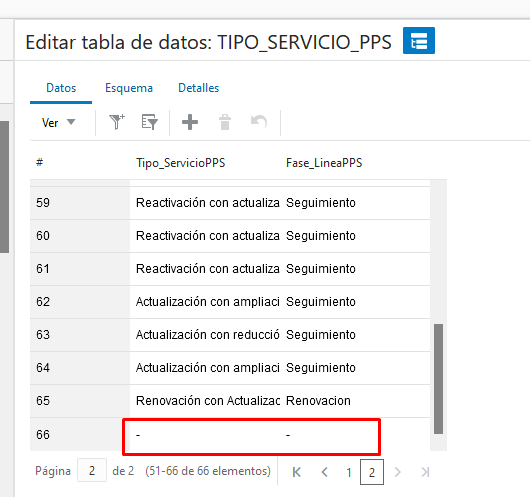
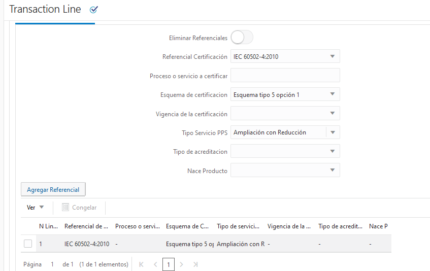

# <Til>Campos vacíos en referenciales IN00027325</Til>

Para la solucion de este caso se realiza la personalizacion de la funcion encargada de añadir el valor de los campos a la tabla de referenciales, esto permitira llenar con un <Variable>**-**</variable> (guion) los valores vacios evitando inconvenientes por valores nulos en las listas de valores

# <Til>Ejecucion

Se agrega el valor <Variable>**-**</variable> (guion) en los campos relacionados con referencial

para el campo de tipo de servicio se edita la tabla relacionada y se edita el filtro asignado al campo

<Til>Filtro:</Til>

    {
        $or:[
            {Fase_LineaPPS:"|fase|"},
            {Fase_LineaPPS:"-"}
        ]
    }

para el resto de campos de tipo menu se agrega el valor <Variable>**-**</variable> (guion) y se establece por defecto

tras la modificacion de la accion agregar referencial, los valores vacios tambien se guardaran con un <Variable>**-**</variable> (guion)

> _**NOTA** : Esta configuracion tambien se realizo para turismo_