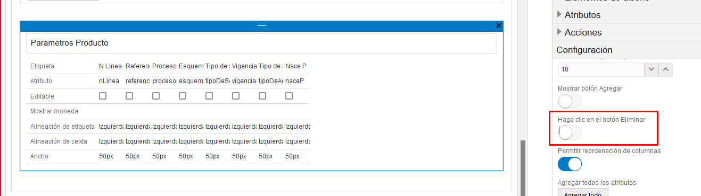

# Eliminacion de referenciales

Se debe agregar la funcionabilidad de eliminar referenciales

-   Remover la accion de eliminar predeterminada
    
-   Agregar un campo tipo booleano (Eliminar)
-   Agregar un boton Eliminar
    ```javascript
        jsonarrayremove(parametrosProducto, numeroDeLinea-1);
        res = "|1~totalesPorServicio~" + jsonarrayrefid(totalesPorServicio) + "|";

        return res; 
    ```
-   Modificar regla de ocultamiento para la visualizacion del boton Eliminar 
-   Visualizacion para campos:
    * solo visibles para la mesa de ayuda 
    * no debe ser visible para el ejecutivo despues de ser aceptado por mesa de ayuda

