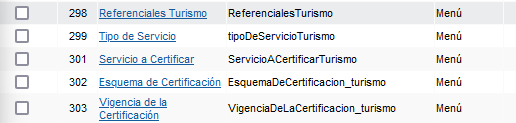
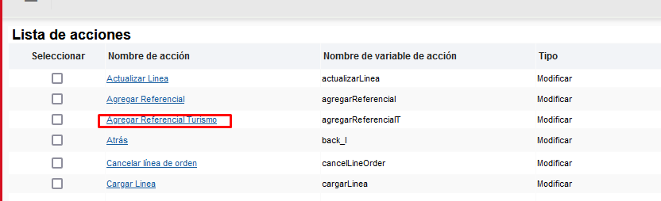
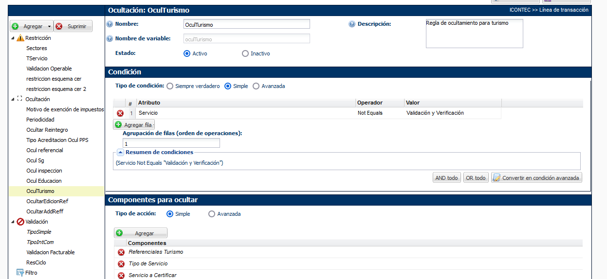

<style>
Variable { color: #c76224 }
Rule { color: #bf2bc4 }
Important { color: #c7c724 }
Til { color: #4d5de3 }
</style>
# Implementacion Turismo


<Important>** Se deben verificar todos los nombre de variable</Important>

## Pasos
### Antes de actualizacion
-   crear los campos necesarios en test (verificar con produccion)
    
-   crear la matriz que contendra los campos de turismo (Parametros turismo)
    
-   crear boton de agregar referencia turismo
    
-   añadir reglas de ocultamiento correcpondientes a turismo, recordar la regla que oculta todos los campos cuando el servicio es diferente a Validación y Verificación [Linea de Turismo]
    

### Para actualizacion
-   Crear el boton tipo booleano llamado Editar Turismo
-   Crear el campo Numero de linea (Este campo permitira seleccionar la linea a editar)
-   Crear accion para carga de linea

        Esta accion debe contemplar unicamente los campos de turismo, en base a la funcion modificar las variables que apuntan a los valores de turismo

    ```js
    //funcion de carga de lineas adecuada a produccion

    res = "";

    datosRef = jsonarrayget(parametrosProducto, numeroDeLinea - 1, "json");
    print(datosRef);

    res = res + _document_number + "~referencialCertificacin_pro~" + jsonget(datosRef, "referencialDeCertificacin", "string") + "|";
    res = res + _document_number + "~procesoOServicioACertificar_pro~" + jsonget(datosRef, "procesoOServicioACertificar", "string") + "|";
    res = res + _document_number + "~esquemaDeCertificacion_pro~" + jsonget(datosRef, "esquemaDeCertificacin", "string") + "|"; 
    res = res + _document_number + "~vigenciaDeLaCertificacin_pro~" + jsonget(datosRef, "vigenciaDeLaCertificacin", "string") + "|";
    res = res + _document_number + "~tipoDeServicoProductopro~" + jsonget(datosRef, "tipoDeServicioProducto", "string") + "|";
    res = res + _document_number + "~tipoDeAcreditacion_pro~" + jsonget(datosRef, "tipoDeAcreditacin", "string") + "|";
    res = res + _document_number + "~naceProducto~" + jsonget(datosRef, "naceP", "string") + "|";
    res = res + _document_number + "~iCS~" + jsonget(datosRef, "iCS_pro", "string") + "|";
    res = res + _document_number + "~divisinNace~" + jsonget(datosRef, "divisinNaceL", "string") + "|";

    return res;
    ```
-   Crear accion para actualizar de linea

        Esta accion debe contemplar unicamente los campos de turismo, en base a la funcion modificar las variables que apuntan a los valores de turismo

    ```js
    //funcion de actualizacion de lineas modificada

    result = "";

    refProd = parametrosProducto;
    sizepp = jsonarraysize(parametrosProducto);
    indices = range(sizepp);


    for index in indices {
        refTemp = jsonarrayget(refProd, index, "json");
        if (index+1 == numeroDeLinea) {
            jsonput(refTemp, "referencialDeCertificacin", referencialCertificacin_pro);
            jsonput(refTemp, "procesoOServicioACertificar", procesoOServicioACertificar_pro);
            jsonput(refTemp, "esquemaDeCertificacin", esquemaDeCertificacion_pro);
            jsonput(refTemp, "tipoDeServicioProducto", tipoServicioPPS);
            jsonput(refTemp, "vigenciaDeLaCertificacin", vigenciaDeLaCertificacin_pro);
            jsonput(refTemp, "tipoDeAcreditacin", tipoDeAcreditacion_pro);
            jsonput(refTemp, "naceP", naceProducto);
            jsonput(refTemp, "iCS_pro", iCS);
            jsonput(refTemp, "divisinNaceL", divisinNace);
            break;
        }
    }

    result = result + "|"+_document_number+"~parametrosProducto~" + jsonarrayrefid(parametrosProducto) + "|";

    return result;
    ```

