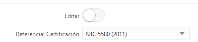

# Gobierno campos a nivel de linea para Producto
### <Til>Requerimiento</Til>:
Basados en la sesión del día de viernes para los referenciales que están a nivel de linea en Producto se requiere que:

1. Cuando el ejecutivo este creando la cotización pueda agregar un referencial diligenciando cualquiera o todos los 8 campos disponibles
2. Cuando se envié a mesa de ayuda la persona puede seleccionar y modificar la información agregada previamente por el ejecutivo si aplica, en caso de que el ejecutivo no haya llenado ningún campo debe poder agregar un referencial.
3. Cuando la cotización quede en estado de Aceptado por mesa de ayuda el ejecutivo no puede modificar la información de referenciales.

Basados en lo anterior tanto el ejecutivo como la persona de la mesa de ayuda tiene gobierno sobre los 8 campos que están actualmente.
___________________
### <Til>Respuesta a Cliente</Til>:
se realizo analisis sobre la solucion llegando a la siguiente estimacion:

* 2h analisis func/tec
* 14h tecnicas que se consumiran ,creacion de campos, vistas y logica para cumplir la edicion de tabla referencial
* 4h funcionales usadas en pruebas y analisis  
* 2h paso a productivo

* la solucion se entregara inicialmente en test.

<Important>** Esta logica aplicara unicamente para la linea de producto segun lo hablado en reuniones

<Important>** Esta logica aplicara unicamente a la vista "Revision mesa de ayuda"

_______________________
### <Til>Analisis</Til>:
Vemos la opcion de crear una seccion de actualizacion de referenciales exclusiva para:

#### <Til>Funcionamiento</Til>:
* Se crea un check que aparecera solo para <Rule>Mesa de Ayuda</Rule>

* Este check se llamara <Rule>Editar</Rule> [<Important>sera de tipo switch</Important>]
* Al presionar el Switch aparecera un campo para indicar la linea a editar
* Se llenaran los campos del formulario de ingreso con los valores de linea seleccionados al presionar el boton <Variable>Cargar Linea</Variable>
*   Tras editar el formulario de ingreso se actualizara la linea presionando el boton <Variable>Actualizar Linea</Variable>
*   Se adiciona una columna llamada N Linea indicando el numero de linea del referencia, esto para identificar la linea a editar