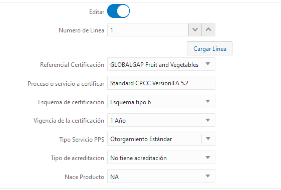

# Gobierno campos a nivel de linea para Producto
### <Til>Requerimiento</Til>:
Basados en la sesión del día de viernes para los referenciales que están a nivel de linea en Producto se requiere que:

1. Cuando el ejecutivo este creando la cotización pueda agregar un referencial diligenciando cualquiera o todos los 8 campos disponibles
2. Cuando se envié a mesa de ayuda la persona puede seleccionar y modificar la información agregada previamente por el ejecutivo si aplica, en caso de que el ejecutivo no haya llenado ningún campo debe poder agregar un referencial.
3. Cuando la cotización quede en estado de Aceptado por mesa de ayuda el ejecutivo no puede modificar la información de referenciales.

Basados en lo anterior tanto el ejecutivo como la persona de la mesa de ayuda tiene gobierno sobre los 8 campos que están actualmente.
___________________
### <Til>Respuesta a Cliente</Til>:
se realizo analisis sobre la solucion llegando a la siguiente estimacion:

* 2h analisis func/tec
* 14h tecnicas que se consumiran ,creacion de campos, vistas y logica para cumplir la edicion de tabla referencial
* 4h funcionales usadas en pruebas y analisis  
* 2h paso a productivo

* la solucion se entregara inicialmente en test.

<Important>** Esta logica aplicara unicamente para la linea de producto segun lo hablado en reuniones

<Important>** Esta logica aplicara unicamente a la vista "Revision mesa de ayuda"

_______________________
### <Til>Analisis</Til>:
Vemos la opcion de crear una seccion de actualizacion de referenciales exclusiva para:

#### <Til>Funcionamiento</Til>:
* Se crea un check que aparecera solo para <Rule>Mesa de Ayuda</Rule>
* Este check se llamara <Rule>Editar</Rule> [<Important>sera de tipo switch</Important>]
* Al presionar el Switch aparecera un campo para seleccionar la Linea a editar
* Se llenaran los campos con los valores de linea seleccionados 

____________________
### <Til>Solucion</Til>:
1. Se crea campo <Variable>Editar</Variable>
    * se deja visible para <Rule>Admin</Rule> y <Rule>miebros de UT</Rule>

2. Se crea campo <Variable>Numero de Linea</Variable>
    * Este campo es numerico y debe tener <Important>Regla de Ocultacion</Important>
    * Se define un rango de <Rule>0 - 25</Rule>

____________
UI:

____________
3. Se crea <Important>Regla de Ocultacion</Important>

    *   Nombre: OcultarEdicionRef
    *   Condicion: 
        *   Editar Equals false    
    *   Componentes a ocultar:
        *   Numero de Linea
        *   Cargar Linea
    _________
    
    *   Nombre: OcultarAddReff
    *   Condicion: 
        *   Editar Equals true    
    *   Componentes a ocultar:
        *   Agregar Referencial
    
4. Se crea accion de <Variable>Cargar Linea</Variable>
    *   Esta funcion cargara los datos de la linea a editar en los campos de edicion  para facilitar el cambio.
    *   Creamos funcion personalizada para cargar valores
    *   La funcion de cargar lineas lee los valores del array y los pobla en los campos de edicion

    *   adicional se crea una regla de actualizacion que consolida los datos en el array
    *   se modifica visivilidad de boton "Agregar Referencial"