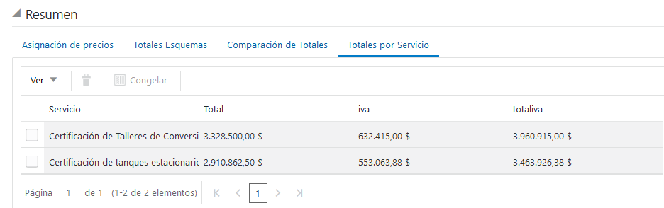
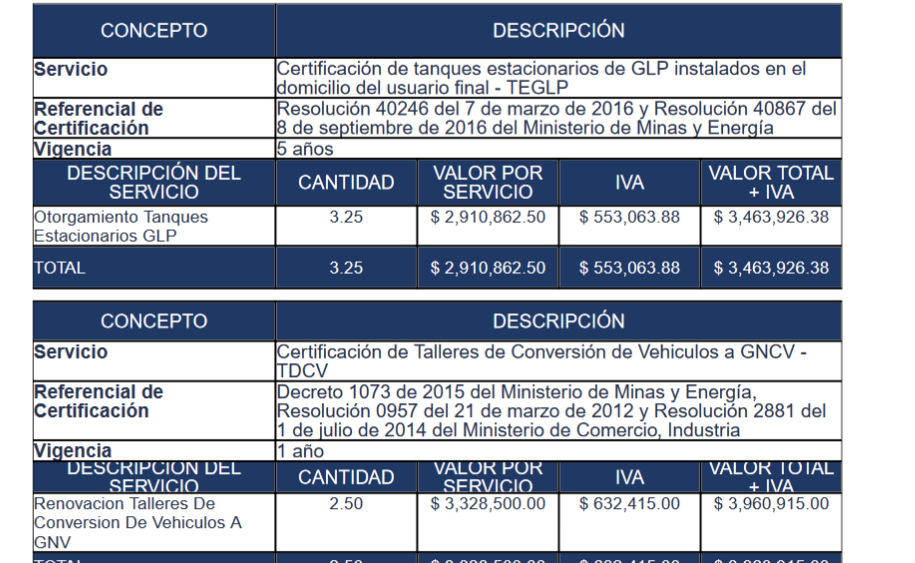

# Ajustes Propuesta F-GV-097 SIA - Versión 2 
## Tareas Ejecutadas:
-   Se realiza reversion del redondeo en las funciones y formulas
-   Se genera un campo tipo matriz que almacenara los totales por servicio
-   Se crea una funcion personalizada que calcula los totales y entrega un diccionaro con los valores requeridos.
-   Se añade una estructura al boton guardar que permite insertar, actualizar o eliminar los registros del campo tipo matriz que contendra los totalizados por servicio de la cotizacion.
- Se añade una modificacion de la estructura anterior para realizar el mismo proceso sobre el boton de generacion de propuesta para garantizar la actualizacion de los datos antes de ejecutar esta accion.
- Se crea una estructura en XSL (Template) que entrega el total del servicio a la estructura que genera las tablas por servicio.
## Reversion de redondeo
Como primera tarea para este requerimiento se elimina redondeo en los campos que realizan calculos, esto debido a los inconvenientes entre facturacion y cotizacion.

## Totales por Servicio

Se contruye una estructura que permita insertar, actualizar o eliminar sobre un campo tipo matriz que contendra el totalizados por servicio de la cotizacion, estos valores son auxiliares y pueden ser ocultos en su paso a produccion

Tras este ajuste se contruyo una platilla XSL que retorna el valor por servicio usado en la estructura de la propuesta, de esta forma ahora es posible visualizar de forma correcta los decimales totalizados.

