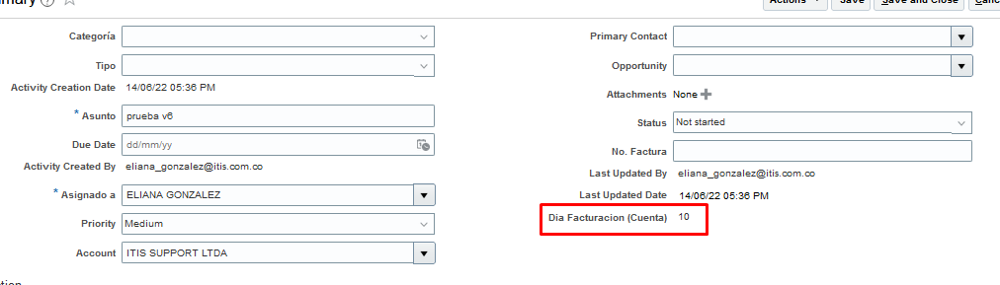

# Asociar campos de cuenta a actividad

-   se crea script general (before insert), que permite la consulta y llenado de los campos en el objeto actividad
-   se crea cada uno de los campos requeridos en la actividad

## Lista de campos
|               campos              |       API name        |
|-----------------------------------|-----------------------|
|    Dia Facturacion                |   DiaFacturacion_c    |
|    Especificaciones Radicación    |   EspecificacionesRadicacion_c
>Estos API name corresponden al objeto CUENTA


## Condiciones Atributos

```Groovy
if(APIname != null){
    return false
}
else{
    return true
}
```
> Aplica para ambos atributos

## Script asociado

```groovy
def diaFacturacion =""
def espRadicacion =""
def vo = newView('OrganizationProfile')
def vc = newViewCriteria(vo)
def vcr = vc.createRow()
def vci = vcr.ensureCriteriaItem('UniqueNameAlias')
vci.setOperator('=')
vci.setValue(AccountName)
vc.insertRow(vcr)
vo.appendViewCriteria(vc)
vo.executeQuery()

while (vo.hasNext()) {
    def currow = vo?.next()
    diaFacturacion = currow.getAttribute('DiaFacturacion_c')
    espRadicacion = currow.getAttribute('EspecificacionesRadicacion_c')
}

setAttribute('DiaFacturacion_c',diaFacturacion)
setAttribute('EspRadicacionCuenta_c',espRadicacion)
```


## Resultado
los valores se llenan automaticamente en los campos correspondientes
